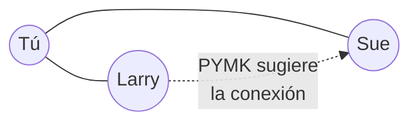

<div align="center">

# People You May Know — LinkedIn

### El proyecto que definió el oficio de científico de datos

**Jerson Daniel Fadiño Bohorquez, Valmore Rodriguez Rosales, Samuel Pinzón Vega, Samuel Alfonso Fuentes Barrera** · Sección A   
Introducción a la Ciencia de Datos — DATA1001
Universidad de los Andes · 2026


</div>

---

## Sobre el proyecto

**People You May Know** (PYMK) es la función de LinkedIn que sugiere a cada usuario personas con las que aún no está conectado pero que probablemente conoce. Fue concebido, prototipado y validado por **Jonathan Goldman**, uno de los primeros científicos de datos de LinkedIn, a partir de 2006.

Es el caso que abre *"Data Scientist: The Sexiest Job of the 21st Century"* (Harvard Business Review, 2012), el artículo que instaló la figura del científico de datos como profesión. Se documenta aquí porque reúne, en un solo proyecto, el ciclo completo que esta materia estudia: una pregunta de negocio, datos desordenados, una hipótesis, un experimento barato y una métrica que decide.

| Ficha técnica | |
|---|---|
| **Científico de datos** | Jonathan Goldman — PhD en Física, Universidad de Stanford |
| **Rol** | Uno de los primeros científicos de datos de LinkedIn |
| **Inicio** | Junio de 2006 |
| **Contexto** | LinkedIn tenía poco menos de **8 millones de cuentas** |
| **Patrocinador** | Reid Hoffman, cofundador y CEO |
| **Resultado** | Desplazó hacia arriba la trayectoria de crecimiento de la empresa |

---

## El proyecto, fase por fase

> Las cinco secciones siguientes siguen **CRISP-DM**, el estándar de la industria para proyectos de datos. *Preparación* y *Modelado* van unidas porque en este caso fueron un mismo ciclo iterativo.

### 1 · Comprensión del negocio

La gente creaba su perfil y no se conectaba con nadie. Un directivo de LinkedIn lo describió así:

> *"Era como llegar a la recepción de un congreso y darte cuenta de que no conoces a nadie. Así que te quedas parado en una esquina bebiendo tu copa — y probablemente te vas temprano."*

Sin conexiones no hay red, y sin red no hay producto. **Pregunta de negocio:** ¿cómo lograr que cada usuario construya su red más rápido?

### 2 · Comprensión de los datos

Goldman no pidió datos nuevos: encontró que la respuesta **ya estaba** en lo que LinkedIn tenía.

| Activo | Señal que contiene |
|---|---|
| Perfiles de los miembros | Universidades, empresas y **fechas** de permanencia en cada una |
| Grafo de conexiones | Quién está conectado con quién |

Sobre la calidad de esos datos, HBR es explícito: *"Todo esto generaba datos sucios y análisis poco manejable, pero conforme empezó a explorar las conexiones de la gente, empezó a ver posibilidades."*

### 3 · Preparación y modelado

**Primera versión — coincidencia de perfil.** Sugerir personas que estuvieron en el mismo colegio o la misma empresa *al mismo tiempo*. El solapamiento de fechas es clave: dos personas en la misma empresa en décadas distintas no se conocen.

**Segunda versión — cierre de triángulos.** Goldman refinó las sugerencias incorporando ideas de análisis de redes, entre ellas el *triangle closing*: **si tú conoces a Larry y a Sue, hay buena probabilidad de que Larry y Sue se conozcan entre sí.**



En términos de datos: los candidatos de un usuario son su **segundo grado** en el grafo, ordenados por cuántos contactos tienen en común con él.

```python
def sugerencias(grafo, usuario, top=3):
    conocidos = set(grafo[usuario])
    candidatos = {}
    for amigo in conocidos:                     # 1er grado
        for posible in grafo[amigo]:            # 2do grado
            if posible != usuario and posible not in conocidos:
                candidatos[posible] = candidatos.get(posible, 0) + 1
    return sorted(candidatos, key=candidatos.get, reverse=True)[:top]
```

> Código ilustrativo escrito para este trabajo. LinkedIn nunca publicó la implementación original.

### 4 · Evaluación

Goldman no pidió que le construyeran la función. Hoffman le había dado una vía para **saltarse el ciclo de producto publicando módulos pequeños en forma de anuncios**, así que creó un anuncio que mostraba **las tres mejores coincidencias** de cada usuario. Ese anuncio fue el experimento.

La métrica fue la **tasa de clics**:

$$CTR = \frac{\text{clics}}{\text{veces que se mostró la sugerencia}}$$

| Medición | Resultado |
|---|---|
| CTR del anuncio inicial | **El más alto jamás visto** en el sitio |
| CTR de PYMK frente a otros avisos del sitio | **+30 %** |
| Tráfico generado | **Millones** de páginas vistas nuevas |

*"En cuestión de días fue evidente que algo notable estaba ocurriendo."*

### 5 · Despliegue e impacto

> [!IMPORTANT]
> El obstáculo no fue técnico. Goldman construyó un prototipo temprano de PYMK, pero **tuvo dificultades para que el área de ingeniería de producto lo incorporara al sitio**. Lo que desbloqueó el proyecto no fue un presupuesto mayor, sino un canal barato para experimentar y una métrica que no admitía discusión.

Una vez lanzada, PYMK cambió la trayectoria de crecimiento de LinkedIn. Hoy es responsable de **más del 50 % del grafo profesional** de la plataforma, y escalarla obligó a LinkedIn a reconstruir su infraestructura: en 2006 corría sobre Oracle; para 2008, con 40–50 millones de miembros, fallaba seguido y los datos se refrescaban cada 6 semanas a 6 meses; hacia 2009, sobre un clúster Hadoop de 20 nodos con hardware reutilizado, el cálculo bajó a 3 días.

---

## Lo que deja el caso

- [x] Partir de una **pregunta de negocio**, no de una técnica
- [x] Mirar primero los datos que **ya existen** antes de pedir nuevos
- [x] Convertir la intuición en **hipótesis falsable**
- [x] Validar con el **experimento más barato posible** antes de pedir recursos
- [x] Elegir **una métrica** que permita decidir
- [x] Reconocer que la barrera suele ser **organizacional**, no algorítmica

---

## Sobre la plantilla usada

Este README combina dos referencias, elegidas por ajustarse a lo que de este caso se conoce con certeza:

- **Estructura:** [Best-README-Template](https://github.com/othneildrew/Best-README-Template) de Othneil Drew (≈16.4k estrellas, 23k forks), la plantilla de README más difundida en GitHub.
- **Organización del contenido:** [CRISP-DM 1.0](https://public.dhe.ibm.com/software/analytics/spss/documentation/modeler/14.2/es/CRISP-DM.pdf), el estándar abierto de ciclo de vida de proyectos de datos.

> Se descartaron varias plantillas más populares para proyectos de datos, por una razón: exige secciones de instalación, dependencias y estructura de código que no están disponibles, ya que, **LinkedIn nunca publicó ni el código ni los datos de 2006**. Lo que sí está documentado es el proceso y el resultado — y eso es exactamente lo que CRISP-DM describe.


---

## Fuentes

1. **Davenport, T. H. y Patil, D. J. (2012).** *Data Scientist: The Sexiest Job of the 21st Century.* Harvard Business Review, octubre 2012. — [hbr.org](https://hbr.org/2012/10/data-scientist-the-sexiest-job-of-the-21st-century)
   *Fuente primaria.* De aquí provienen todas las citas textuales, las fechas, el rol de Reid Hoffman, el cierre de triángulos y las tres métricas. Patil fue Head of Data Products de LinkedIn: es testigo directo, lo que da valor al relato y a la vez conviene tener presente al leerlo.
2. **Chan Zuckerberg Initiative.** *CZI Expands Technology Team Leadership.* — [chanzuckerberg.com](https://chanzuckerberg.com/newsroom/czi-expands-technology-team-leadership/)
   Biografía institucional de Goldman: PhD en Física de Stanford, uno de los primeros científicos de datos de LinkedIn.
3. **LinkedIn Engineering.** *Artificial Intelligence* y *A Brief History of Scaling LinkedIn.* — [engineering.linkedin.com](https://engineering.linkedin.com/teams/data/artificial-intelligence)
   Peso actual de PYMK en el grafo profesional y evolución de la infraestructura.
4. **Chapman, P. et al. (2000).** *CRISP-DM 1.0: Step-by-step data mining guide.* — [IBM/SPSS](https://public.dhe.ibm.com/software/analytics/spss/documentation/modeler/14.2/es/CRISP-DM.pdf)

---

<div align="center">
<sub>Trabajo académico para DATA1001 — Universidad de los Andes, 2026.<br/>
Este repositorio documenta un proyecto ajeno con fines educativos; las citas de Harvard Business Review se reproducen de forma breve y con atribución.</sub>
</div>
